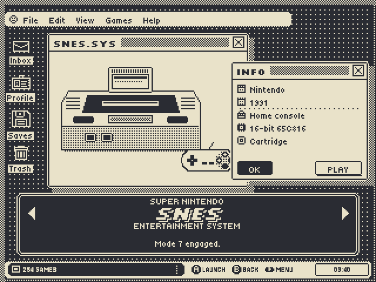
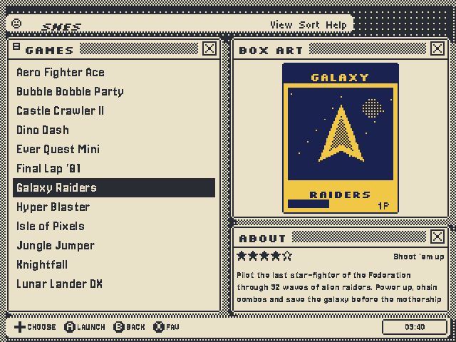
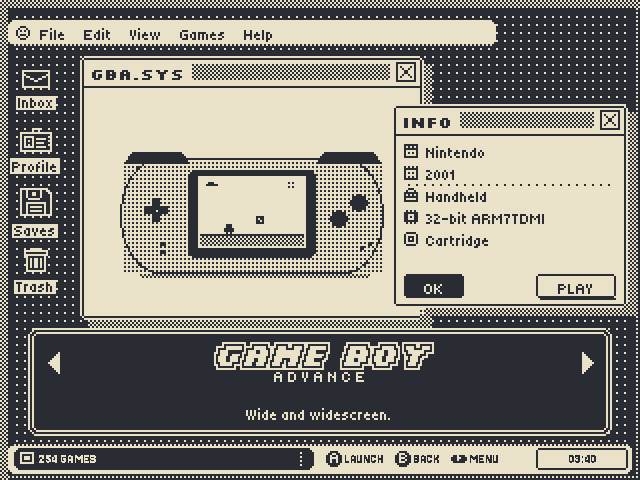
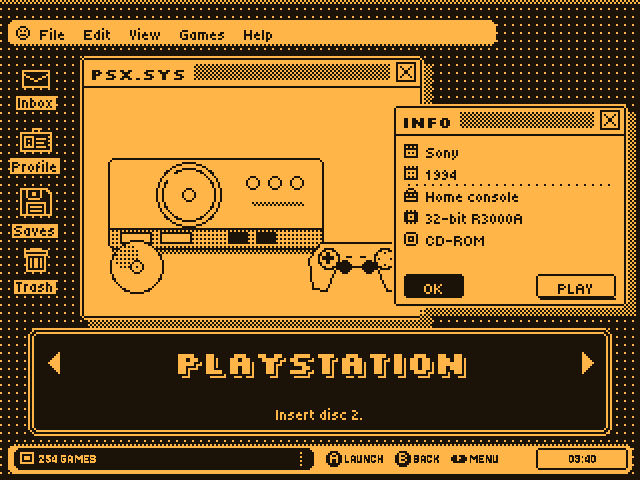
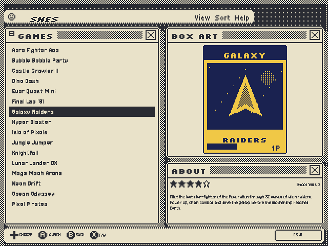
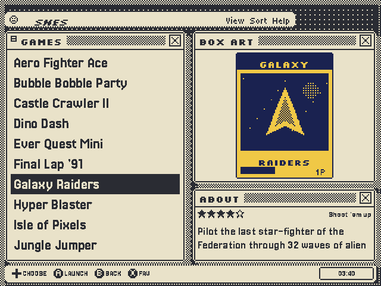
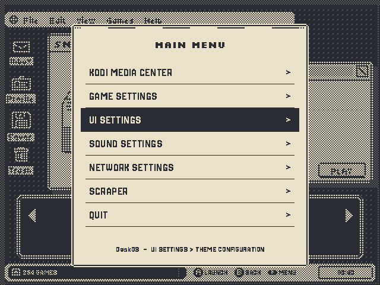
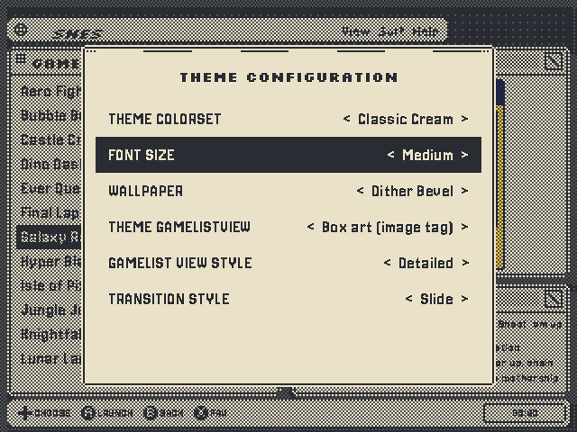
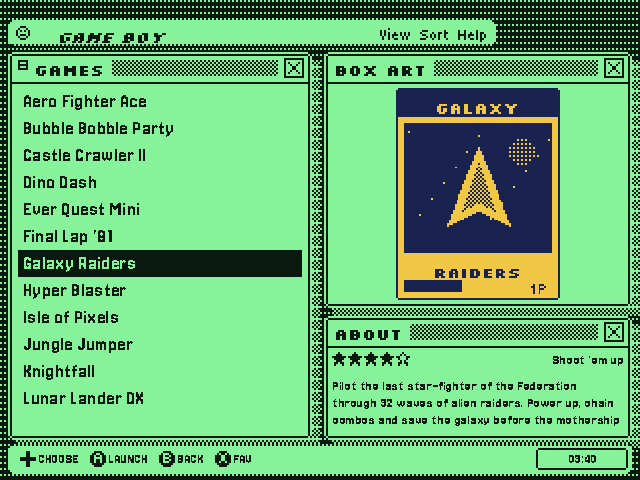
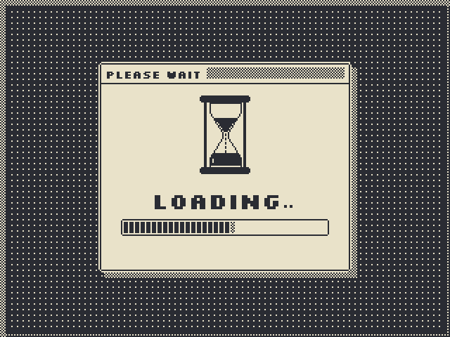

# DeskOS: a 1-bit pixel EmulationStation theme for the R36S

 

DeskOS turns EmulationStation into a retro desktop. It uses a dark dithered
desktop, cream windows with checkered title bars, a dark dialog for the system
carousel and a taskbar along the bottom. The art is drawn natively for the
R36S **640×480** screen: every image is pixel-exact at 1:1, so nothing gets
blurred by scaling.

## Features

| | |
|---|---|
| **Pixel fonts** | Silkscreen (titles), Jersey 10/15/20/25 (lists and text). Each size is drawn at its native pixel grid. All fonts are OFL. |
| **Font size option** | **Small / Medium / Big** under *Theme configuration*. This changes the game list, description, menus, help bar and clock. The description always uses a smaller font than the list. |
| **7 colorsets** | Classic Cream (default), Amber CRT, Green Phosphor, Pocket Pea, Ice Blue, Bubblegum, Paper White |
| **5 wallpapers** | Dither Bevel, Dot Grid, Weave, Scanlines, Plain |
| **Box-art source** | Fill the BOX ART window from the `<image>`, `<thumbnail>` or `<marquee>` tag of your gamelist.xml |
| **89 hand-built system screens** | Pixel-art hardware, a logo and a spec sheet (maker, year, type, CPU, media and a tagline) for each one. They cover 152 system folder names, including aliases such as `genesis`/`megadrive`, `pcengine`/`tg16` and `mame2003plus`. |
| **Game list layout** | Game list on the left. Box art fills the top ⅔ of the right side. Rating, genre and the scrolling description (small font) fill the bottom ⅓. |
| **Menus** | Menus use the same window style as the desktop: a pixel 9-patch frame, a checker modal fade, pixel switches, slider knob, buttons and text fields |
| **Help bar** | Custom pixel button icons (A/B/X/Y/L/R/Start/Select/D-pad) in the taskbar |
| **Clock** | Shown in the taskbar's clock well (bottom right) |
| **Hourglass loading screen** | `splash/splash.svg` for ES's own loading screen, plus PNG/JPG/animated GIF versions in every colorset |
| **Battery-safe** | Nothing is drawn in the top 20 px or the top-right corner, where ArkOS draws its battery, volume and Wi-Fi bar |

## Install

1. Copy the folder `es-theme-deskos` to your themes folder:
   - **ArkOS**: `/roms/themes/` (or `EASYROMS/themes` on the SD card)
   - **AmberELEC / ROCKNIX / dArkOS**: `/storage/.config/emulationstation/themes/` or `/roms/themes/`
2. Restart EmulationStation. Then go to **Start → UI Settings → Theme set → es-theme-deskos**.
3. Go to **UI Settings → Theme configuration** to choose the **colorset**, **Font size**, **Wallpaper** and **gamelist view** (box-art source).
4. Optional: in UI settings, turn on **Show clock** so the taskbar clock appears.
5. Optional: set **Gamelist view style → Detailed** so the box art and description panels show even for systems without many scraped images.

### Hourglass loading screen

EmulationStation draws its *Loading…* screen from `resources/splash.svg`. A copy
in your home folder takes priority, so you don't have to modify the system:

```sh
mkdir -p ~/.emulationstation/resources
cp splash/splash.svg ~/.emulationstation/resources/splash.svg
```

On ArkOS, `~` is `/home/ark`. Delete the file to go back to the stock splash.
The folder also contains full-screen `loading_<colorset>.png/.jpg` and an
animated `loading_<colorset>.gif`. Use these with launch-image or boot-logo
features on firmwares that have them.

## Scraping tips

- **Box art**: scrape *Box 2D* into the image slot. If your scraper puts box art in `<thumbnail>`, select **Theme configuration → Gamelist view → Box art (thumbnail tag)**.
- Games with no art get a pixel "NO BOX ART" floppy in the BOX ART window.
- The description scrolls automatically in the bottom-right window.

## Rebuilding / customising

All artwork and XML is generated by a script. Change it and rebuild in about 20 seconds:

```sh
pip install pillow numpy
python3 tools/build.py        # writes es-theme-deskos/, splash/, preview/
```

- `tools/build.py`: palettes, font-size presets, screen layout, XML and previews
- `tools/consoles.py`: one function per pixel-art machine (160×104 logical px)
- `tools/systems.py`: folder → art, logo style and spec sheet
- `tools/pix.py`: the small 1-bit drawing toolkit

Every graphic is stored as a white mask and tinted by the colorset. To add a
palette, add one line to `PALETTES` and rebuild.

## Previews

| | |
|---|---|
|  |  |
|  Font size: Small |  Font size: Big |
|  Main menu |  Theme options |
|  |  Loading |

`preview/all_systems.png` shows every system screen. `preview/palettes.png` shows every colorset.
The previews are drawn by the build script to approximate the on-device result.

## Compatibility notes

- Built for the EmulationStation **fcamod** fork used by ArkOS, and for the batocera-style ES used by AmberELEC and ROCKNIX on the R36S. It uses theme subsets, `${variables}` and the `menu`/`screen` views of these forks.
- **Not** compatible with ES-DE, which uses a different theme format.
- Logos and console drawings are original pixel art in the spirit of each system. They are not copies of the trademarked artwork.

## Credits and licences

- Fonts: Silkscreen (Jason Kottke), Jersey 10/15/20/25 (Sarah Cadigan-Fried), Tiny5 (Gissio). All are under the SIL Open Font License. The licence texts are in `es-theme-deskos/_art/fonts/`.
- The visual direction comes from 1-bit desktop UIs.
