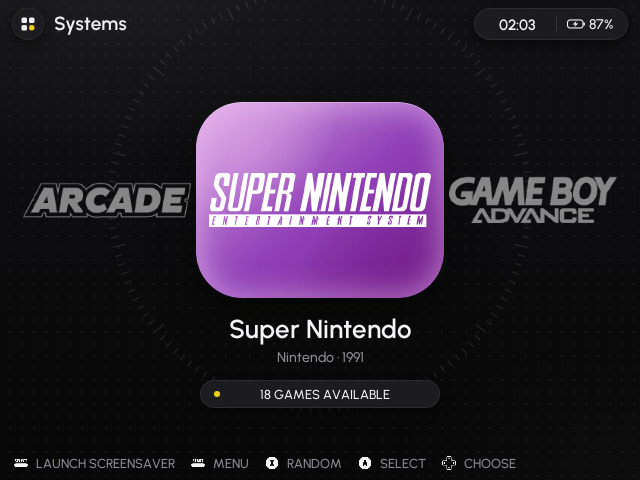
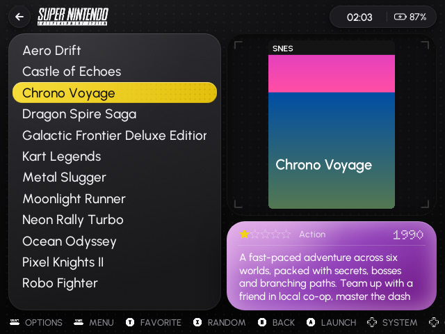
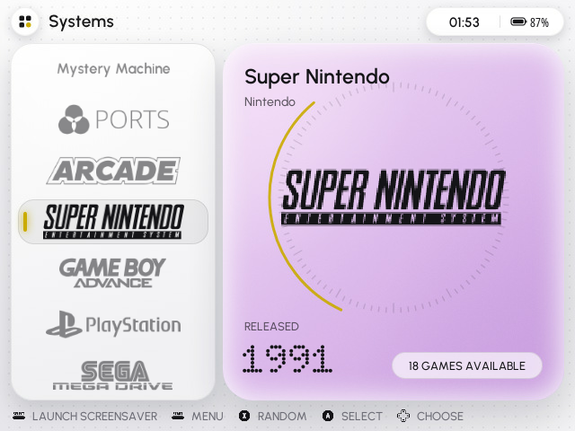
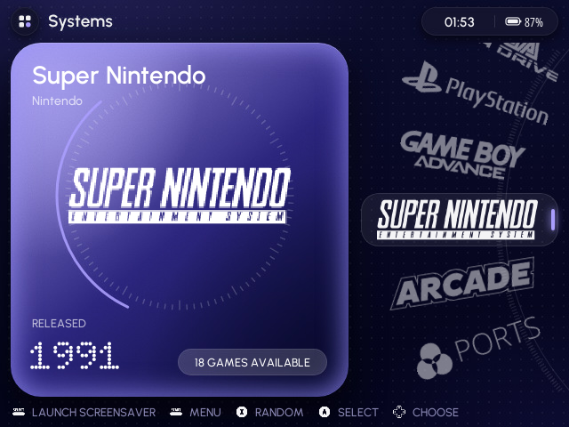
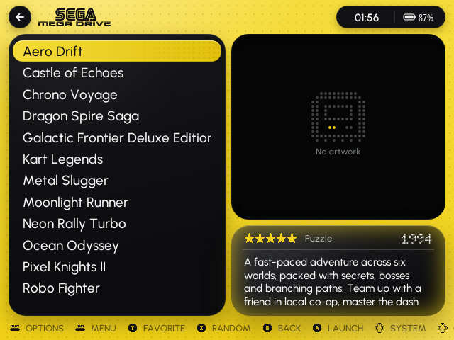
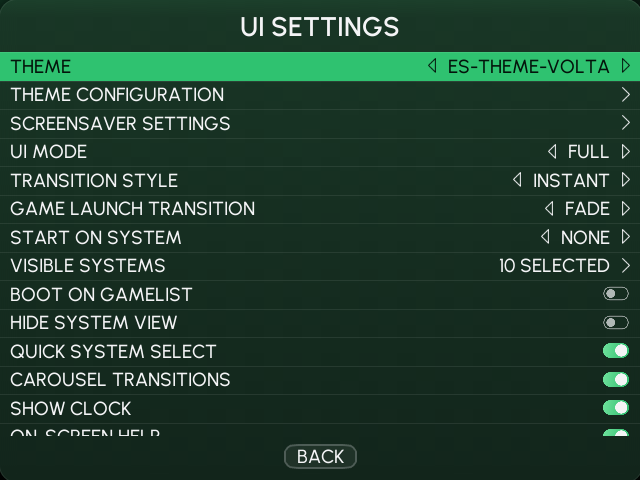
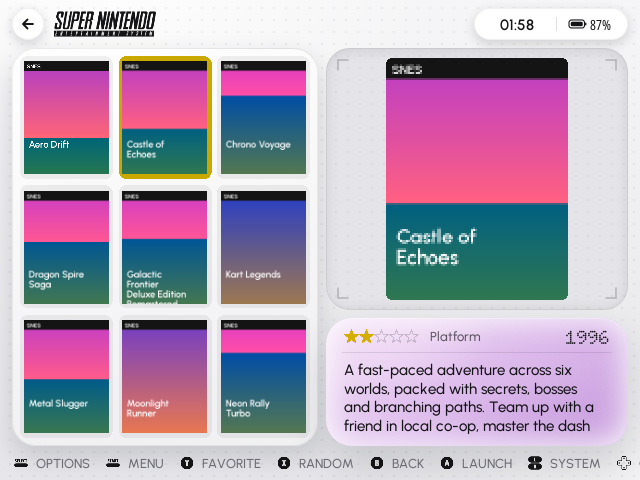
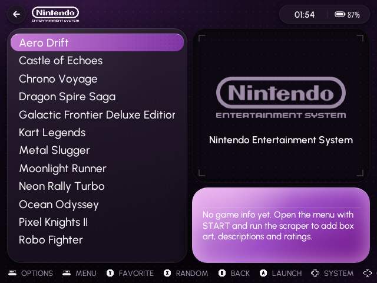
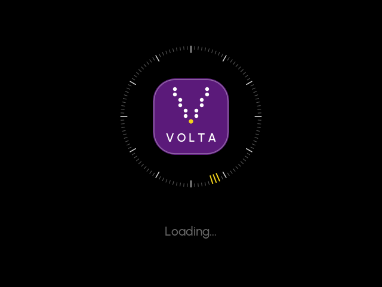
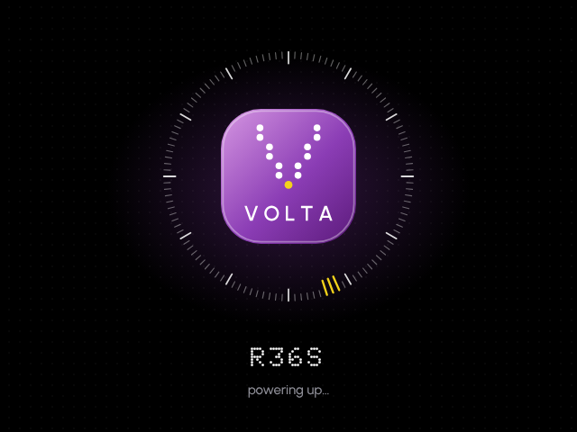

# Volta: an EmulationStation theme for the R36S

A dark/light, multi-colour EmulationStation theme for the **R36S running ArkOS** (640×480). It was
designed from the "energy dashboard" UI references: graphite tiles, glossy gradient cards, tick-ring gauges,
dot-matrix numerals and a yellow accent.




| | |
|---|---|
|  |  |
|  |  |
|  |  |
|  |  |

All 13 colour schemes: [`_preview/all-colorsets.png`](_preview/all-colorsets.png).
Every screenshot above was taken from ArkOS's own EmulationStation, built from source, except the
loading-screen image, which is rendered with ES's own SVG renderer.

## Features

- **Game list**: list of games on the left half. Box art fills the top two thirds on the right, and
  rating, genre, year and a scrolling description fill the bottom third. Games without box art show a
  "No artwork" placeholder. Detailed, video, grid and basic (unscraped) styles are all themed.
- **System carousel with three orientations**: Horizontal, Vertical list, or Wheel. The vertical and
  wheel layouts show a per-system card with maker, release year (dot-matrix) and game count.
- **13 colour schemes**: Volta, Violet, Indigo, Aqua, Ember and Mint, each in Dark and Light, plus
  Citrine Pop.
- **3 font sizes**: Small, Medium, Large. They change the game list, descriptions, system names and the
  settings menu.
- **Themed settings menu**: panel, accent selector, switches, slider, buttons and Urbanist type in every
  colour scheme.
- **Status capsule at the top right**: ArkOS's battery indicator and the clock sit inside it, styled with
  the theme's own battery icons.
- **163 high-quality system logos** covering every ArkOS system plus collections and arcade publishers.
  They are white and tinted per scheme.
- **Custom boot logo and loading screens** that replace the defaults (see below).
- Fonts: [Urbanist](https://fonts.google.com/specimen/Urbanist) for the UI and
  [Doto](https://fonts.google.com/specimen/Doto) for the dot-matrix numerals.

## Install

1. Copy the `es-theme-volta` folder into the `themes` folder on your SD card (`EASYROMS/themes`,
   which is `/roms/themes` on the device).
2. On the R36S: **Start → UI Settings → Theme → es-theme-volta**.
3. **Start → UI Settings → Theme Configuration** to choose:
   - *Color scheme*
   - *Font size*
   - *System carousel* (Horizontal / Vertical list / Wheel)
4. Optional: in *UI Settings*, set *Game list view style* to *Detailed* (or *Video* / *Grid*).

### Boot logo and loading screens

`_boot/install.sh` replaces three things:

| What | How |
|---|---|
| EmulationStation startup screen and game-launch loading screen | copies `splash.svg` to `~/.emulationstation/resources/`, which ES checks before its built-in resources (no system files are touched) |
| Loading text and battery % font | copies Urbanist over ES's default font in the same folder |
| u-boot boot logo | replaces `logo.bmp` on the BOOT partition, only when the existing file is a plain 640×480 or 480×640 BMP at 8 or 24 bits. The original is backed up first |

Run it over SSH:

```sh
bash /roms/themes/es-theme-volta/_boot/install.sh            # everything
bash /roms/themes/es-theme-volta/_boot/install.sh --no-bootlogo
bash /roms/themes/es-theme-volta/_boot/install.sh --uninstall  # restore the originals
```

Or copy `install.sh` into the `ports` folder and launch it from the Ports menu. Restart EmulationStation
or reboot to see the change.

Boot-logo files differ between R36S images and clones. If your logo is portrait (480×640) and shows
sideways after installing, run the script again with `--portrait-ccw`. Unrecognised formats are left
alone; you can also copy `_boot/logo-640x480-24.bmp` to the BOOT partition as `logo.bmp` from a PC.

## Notes for the R36S

- ArkOS's EmulationStation (the `351v` branch of christianhaitian/EmulationStation-fcamod) counts
  640×480 as a "small screen" and enlarges every font by 1.31×. The theme compensates, so text renders
  at the designed pixel sizes.
- On small screens ES hides the clock and battery while a menu is open. The menus are full-screen.
- The bundled fonts map U+007F to an empty glyph. Without this, ES sizes every line from a tall
  placeholder glyph and list text sits off-centre.

## Rebuilding / customising

All artwork and XML are generated by `build/build.py`. Layout constants, the colour schemes
(`build/palettes.py`) and system metadata (`build/systems.py`) live in one place, so art and element
positions stay in sync. Do not edit the generated XML by hand.

```sh
pip install pillow fonttools freetype-py
python3 build/fonts.py /path/to/google-fonts/ofl          # static TTFs (only when changing fonts)
ABN_LOGOS=/path/to/art-book-next-es-de/_inc/systems/logos python3 build/build.py
ONLY=xml python3 build/build.py                            # just regenerate XML
```

The build needs Node.js and Playwright's Chromium to render the artwork.

## Credits & licences

- System logos: from [Art Book Next](https://github.com/anthonycaccese/art-book-next-es-de) by Anthony
  Caccese, CC BY-NC-SA 2.0, rasterised to white PNGs. Typographic logos for systems without one are
  generated. Logos are trademarks of their owners.
- Fonts: Urbanist and Doto, SIL Open Font License (see `_fonts/`).
- Because of the logo licence, the theme as a whole is shared under **CC BY-NC-SA**.
