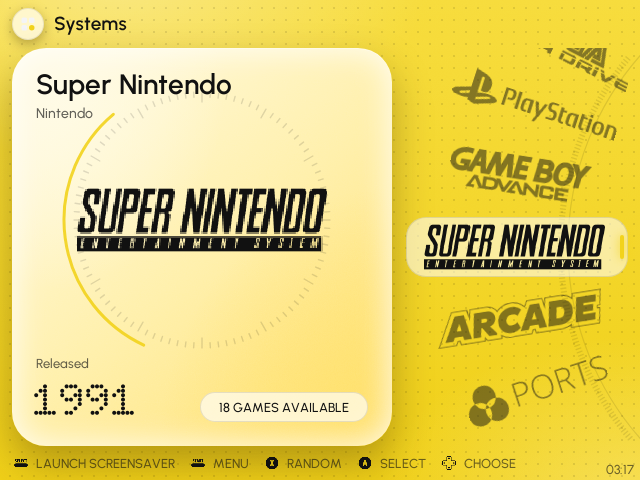
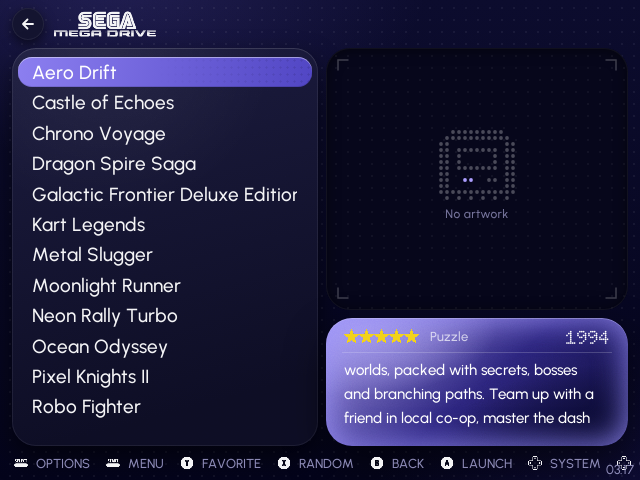
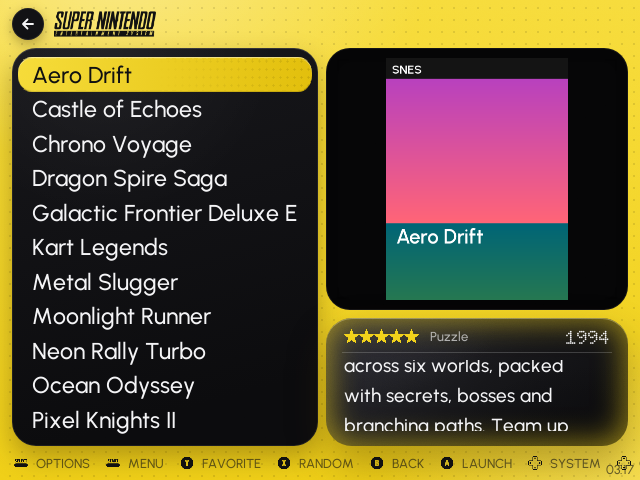
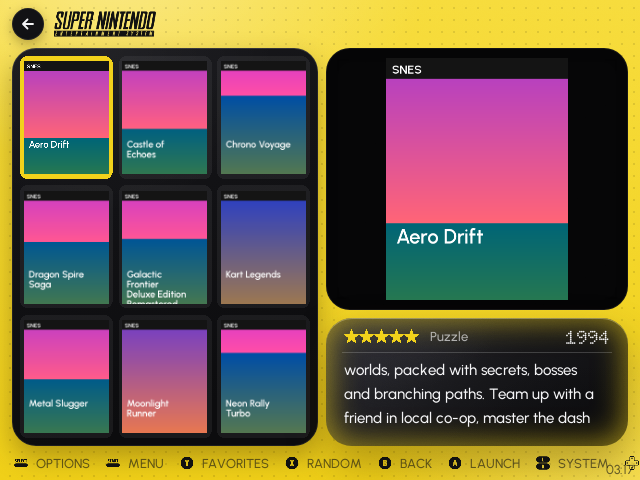
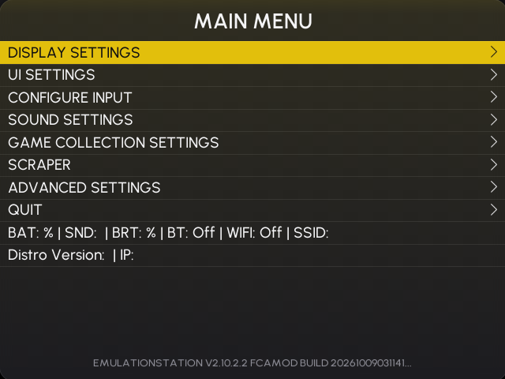

# Volta: an EmulationStation theme for the R36S

A dark/light, multi-colour EmulationStation theme for the **R36S running ArkOS / dArkOS** (640×480),
based on the "energy dashboard" UI references: graphite tiles, glossy gradient cards, tick-ring
gauges, dot-matrix numerals and a yellow accent.


| | |
|---|---|
|  |  |
|  |  |
|  |  |

All 13 colour schemes: [`_preview/all-colorsets.png`](_preview/all-colorsets.png).
The screenshots come from ArkOS's EmulationStation (the `503` and `351v` branches of
christianhaitian/EmulationStation-fcamod), built from source.

## Features

- **Game list**: list of games on the left half. Box art fills the top two thirds on the right, and
  rating, genre, year and a scrolling description fill the bottom third. Games without box art show a
  "No artwork" placeholder. Detailed, video, grid and basic (unscraped) styles are all themed.
- **System carousel with three orientations**: Horizontal, Vertical list or Wheel. The vertical and
  wheel layouts show a card for each system with its maker, release year (dot-matrix) and game count.
- **13 colour schemes**: Volta, Violet, Indigo, Aqua, Ember and Mint, each in Dark and Light, plus
  Citrine Pop.
- **3 font sizes**: Medium, Small, Large.
- **Themed settings menu**: panel, accent selector, switches, slider, buttons and Urbanist type in every
  colour scheme.
- **Battery-safe corner**: nothing is drawn in the top-right corner (x > 448, y < 40), so ArkOS's own
  battery and clock never overlap the design.
- **163 high-quality system logos**, white and tinted per scheme.
- **Loading screen** built into the theme (a `splash` view), plus optional boot-logo and loading-screen
  extras (see below).
- Fonts: [Urbanist](https://fonts.google.com/specimen/Urbanist) for the UI and
  [Doto](https://fonts.google.com/specimen/Doto) for the dot-matrix numerals.

## Install

1. Copy the `es-theme-volta` folder into the `themes` folder on your SD card (`EASYROMS/themes`,
   which is `/roms/themes` on the device). You should end up with `themes/es-theme-volta/theme.xml`.
2. On the R36S: **Start → UI Settings → Theme Set → es-theme-volta**. Restart EmulationStation if the
   theme doesn't switch straight away.
3. **Start → UI Settings → Theme Configuration** to choose:

| Option | Choices (the first is the default) |
|---|---|
| Color scheme | Volta Dark · Volta Light · Violet Dark/Light · Indigo Dark/Light · Aqua Dark/Light · Ember Dark/Light · Mint Dark/Light · Citrine Pop |
| Font size | Medium · Small · Large |
| System carousel | Horizontal · Vertical list · Wheel |

The `_preview` folder is only for screenshots, and `_boot` only for the optional extras. Neither is
needed on the SD card.

## Optional extras: boot logo and EmulationStation loading screen

The theme doesn't need these, and nothing outside the theme folder is changed unless you run the
script **with an option**:

```sh
bash /roms/themes/es-theme-volta/_boot/install.sh --splash      # ES startup / game-launch loading screen
bash /roms/themes/es-theme-volta/_boot/install.sh --bootlogo    # u-boot boot logo (logo.bmp)
bash /roms/themes/es-theme-volta/_boot/install.sh --uninstall   # undo everything (also the first release)
```

- `--splash` copies `splash.svg` to `~/.emulationstation/resources/`, which ES checks before its
  built-in files.
- `--bootlogo` only replaces `logo.bmp` when the existing file is a plain uncompressed 640×480 or
  480×640 BMP at 8 or 24 bits. The original is kept as `logo.bmp.volta-backup` on the BOOT partition, so
  you can restore it from a PC.
- The script no longer replaces ES's default font. The first release did; `--uninstall` removes it.

## Troubleshooting

- **Black screen / EmulationStation keeps restarting after installing the first release (1.0).**
  1. Put the SD card in a PC and delete `EASYROMS/themes/es-theme-volta`. ES then falls back to
     another theme.
  2. If you ran `install.sh` from 1.0, it may have replaced `logo.bmp`, ES's default font and its
     loading screen. Once the console boots, run `install.sh --uninstall` from this version (over SSH or
     from the Ports menu) to restore the originals.
  3. If the console resets before EmulationStation even appears, restore the original `logo.bmp` on the
     BOOT partition from your firmware image.

  Then copy in this version. It uses the same structure as themes that run on the R36S and installs
  nothing outside the theme folder.
- **The theme isn't in the list, or systems look unthemed.** The folder must sit directly in `themes`:
  `themes/es-theme-volta/theme.xml`. "Extract all…" often creates
  `themes/es-theme-volta/es-theme-volta/`. Move the inner folder up a level.
- **Text looks small on ROCKNIX / AmberELEC / Knulli.** The sizes are tuned for ArkOS/dArkOS, whose ES
  enlarges fonts by 1.31× on this screen. Pick *Font size → Large*.
- Still broken? Send `/home/ark/.emulationstation/es_log.txt` and the name and version of your firmware.

## How the theme is built

```
theme.xml               fallback for systems without their own folder
<system>/theme.xml      per-system variables (logo, name, maker, year), the include of
                        _inc/main.xml, then the option subsets at the top level
_inc/main.xml           every view with literal default values (Volta Dark, Medium, Horizontal)
_inc/color-*.xml        colour scheme: only the properties it changes
_inc/font-*.xml         font size: only the properties it changes
_inc/system-*.xml       carousel layout: only the properties it changes
_art/                   PNG artwork (per scheme), logos, splash, UI icons
_fonts/                 Urbanist + Doto (static TTFs)
```

Option files never define variables. If an option fails to load, or a setting saved by another theme
matches nothing, the theme still renders completely with its defaults.

## Rebuilding / customising

All artwork and XML are generated by `build/build.py` (art) and `build/xmlgen.py` (XML). Layout
constants, the colour schemes (`build/palettes.py`) and system metadata (`build/systems.py`) live in one
place. The build checks that the defaults plus each option's overrides reproduce every combination
exactly. Do not edit the generated XML by hand.

```sh
pip install pillow fonttools freetype-py
python3 build/fonts.py /path/to/google-fonts/ofl          # static TTFs (only when changing fonts)
ABN_LOGOS=/path/to/art-book-next-es-de/_inc/systems/logos python3 build/build.py
ONLY=xml python3 build/build.py                            # just regenerate XML
```

The build needs Node.js and Playwright's Chromium to render the artwork.

## Credits & licences

- System logos: from [Art Book Next](https://github.com/anthonycaccese/art-book-next-es-de) by Anthony
  Caccese, CC BY-NC-SA 2.0, rasterised to white PNGs. Typographic logos for systems without one are
  generated. Logos are trademarks of their owners.
- Fonts: Urbanist and Doto, SIL Open Font License (see `_fonts/`).
- Because of the logo licence, the theme as a whole is shared under **CC BY-NC-SA**.
