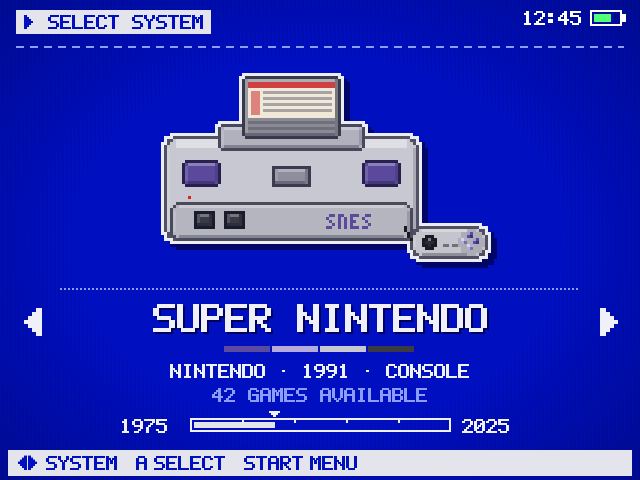
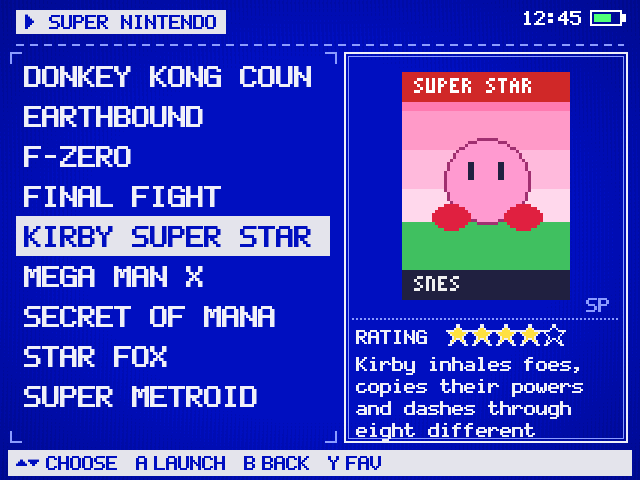
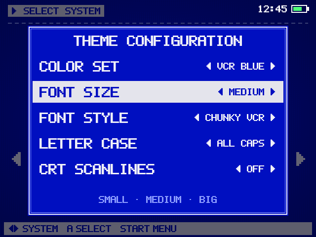
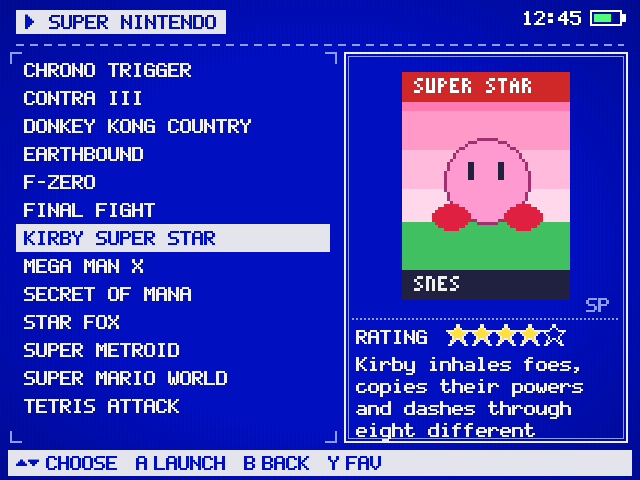
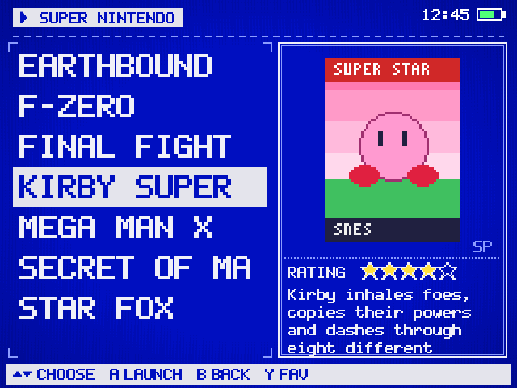
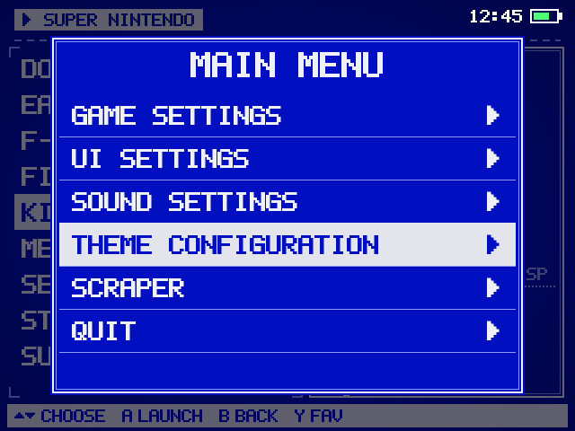
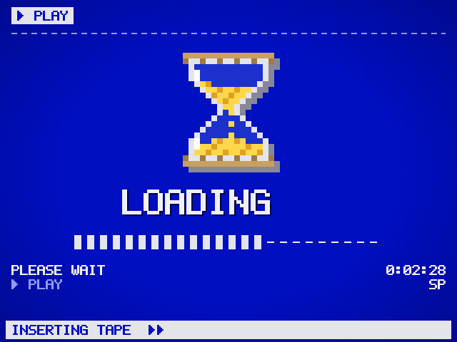

# VCR OSD — EmulationStation theme for the R36S

A blue-screen VHS/VCR on-screen-display theme for 640×480 handhelds (R36S and
clones running ArkOS / dArkOS and similar EmulationStation-fcamod builds).
Everything is pixel art drawn at an exact integer scale for 640×480, so
nothing is blurred by resampling.

 

## Features

- **VCR OSD look**: flat VCR-blue screen, inverse "AUTO"-style highlight boxes,
  dashed rules, a tape-counter "BEGIN/END" bar and a help bar at the bottom.
- **Custom pixel font "OSD Tape"**, built from scratch for this theme (no
  third-party font licence). It has two styles: *Chunky VCR* (heavy verticals,
  like the reference image) and *Clean OSD*. Both are pixel-perfect at 16/24/32 px.
- **Font size: SMALL / MEDIUM / BIG**, chosen from the menu (16 / 24 / 32 px for
  the game list and the menus). Game descriptions always stay small (16 px).
- **Settings menu matches the main UI**: same blue background, pixel font, inverse
  selector, OSD double frame, ON/OFF switch boxes and slider knob.
- **153 system folders** with **hand-drawn pixel hardware** (consoles,
  handhelds, computers, arcade cabinets; CRT TVs with labelled VHS tapes for
  engines, ports and collections), a **pixel wordmark logo** with brand colour
  stripes, maker/year/type info and a release-year timeline for each one.
  See [`_preview/all-systems.png`](_preview/all-systems.png).
- **Hourglass loading screen** that reads "LOADING…": a still for the splash
  view plus an 8-frame animated GIF (`_art/loading/loading.gif`).
- **Game list layout**: games on the left; box art in the top two thirds of the
  right panel (SMPTE colour bars and "NO SIGNAL" when art is missing); rating
  stars and the small-font description in the bottom third.
- **Battery-safe corner**: nothing is drawn in the top-right corner
  (x > 448 px, y < 40 px), so the ArkOS battery and clock never overlap the design.

## Install

1. Copy the whole `es-theme-vcr-osd` folder to the `themes` folder on your SD card:
   - one-card setup: `/roms/themes/es-theme-vcr-osd`
   - two-card setup: `/roms2/themes/es-theme-vcr-osd` (or wherever your other themes are)
2. On the device: **START → UI SETTINGS → THEME SET → es-theme-vcr-osd**.
3. Restart EmulationStation if the theme does not switch straight away.

The `_preview` folder is only for screenshots. You can leave it off the SD card.

## Customise (START → UI SETTINGS → THEME CONFIGURATION)

| Option | Choices (first one is the default) |
| --- | --- |
| COLOR SET | VCR BLUE · DEEP NAVY · MIDNIGHT |
| FONT SIZE | MEDIUM · SMALL · BIG |
| FONT STYLE | CHUNKY VCR · CLEAN OSD |
| LETTER CASE | ALL CAPS · AS SCRAPED |
| CRT SCANLINES | OFF · ON |



If your EmulationStation build does not list the custom options, edit the
defaults in `_inc/main.xml`. Font sizes there are fractions of the screen
height: `0.03340` = 16 px, `0.05006` = 24 px, `0.06673` = 32 px.

## Screens

| Small font | Big font |
| --- | --- |
|  |  |
| **Menu** | **Loading** |
|  |  |

## Layout (640×480)

```
┌──────────────────────────────────────────── ░battery/clock░┐  y 0-40   tag + reserved corner
│ ▶ SUPER NINTENDO                                           │
│ - - - - - - - - - - - - - - - - - - - - - - - - - - - - - -│  y 44
│ GAME LIST            │  BOX ART  (x 352-620, y 60-312)     │
│ x 16-330             │                                     │
│ y 56-438             ├ RATING ★★★★☆ ───────────────────────│  y 318
│                      │  description, 16 px, auto-scroll    │
│                      │  (y 354-436)                        │
├────────────────────────────────────────────────────────────┤
│ ▲▼ CHOOSE  A LAUNCH  B BACK            (help bar, y 450-476)│
└────────────────────────────────────────────────────────────┘
```

## Folder structure

```
theme.xml               fallback for systems without their own folder
<system>/theme.xml      per-system variables (name, maker, year) + option subsets
_inc/main.xml           shared layout for every view (system, gamelists, menu, splash)
_inc/*.xml              option files (colour set, font size, font style, case, scanlines)
_art/fonts/             OSD Tape pixel fonts (TTF)
_art/consoles/          hardware art, 360x240 (system view) and small/ 240x160 (basic view)
_art/logos/             480x64 pixel wordmarks used by the carousel
_art/timeline/          release-year tape-counter bars
_art/ui/                backgrounds, menu nine-patches, stars, switches, scanlines
_art/loading/           hourglass loading screen (PNG per colour set + animated GIF)
```

## Rebuilding / adding a system

All images and XML come from the Python scripts in `../theme-tools`
(Pillow + fontTools):

```bash
pip install pillow fonttools
cd theme-tools
python3 build_theme.py ../es-theme-vcr-osd        # everything
python3 preview.py ../es-theme-vcr-osd ../es-theme-vcr-osd/_preview
```

To add a system, add a row to `systems.py` (name, maker, year, type, four
brand colours) and an entry in `consoles.ART` (reuse an archetype such as
`soft(...)`, `arcade_cab(...)` or `computer(...)`), then rebuild.

## Notes

- The logos are original pixel wordmarks that spell out each system's name.
  They are not copies of the manufacturers' trademarked logos.
- The previews are rendered with Pillow to match the theme's layout. They are not
  photos from a device, so spacing in EmulationStation can differ by a pixel or two.
- The fonts (OSD Tape Regular/Chunky) are released under the SIL Open Font
  Licence 1.1. Game and system names belong to their respective owners.
