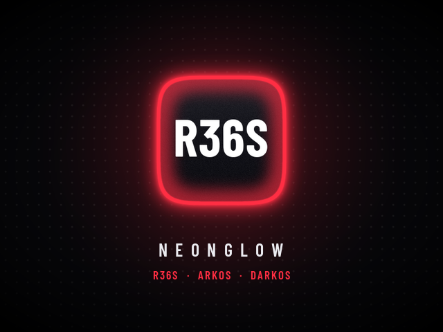
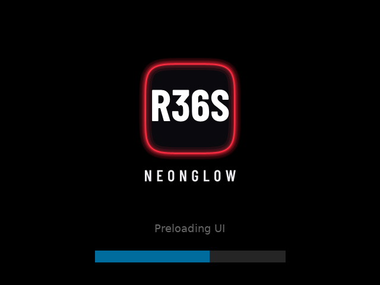
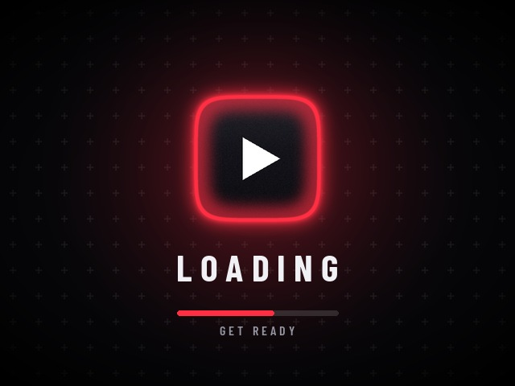

# NeonGlow: EmulationStation theme for the R36S

A dark "deep glow" theme for the **R36S** (and clones) running **ArkOS** or **dArkOS** (EmulationStation-fcamod, 640×480). It comes with its own boot logo, EmulationStation loading screen and game-launch screen.


## Features

| | |
|---|---|
| **194 systems** | Each system gets a glowing glass tile built from high-quality vector logos. Every system in dArkOS/ArkOS `es_systems.cfg` is covered, plus ArkOS aliases, the auto collections and the arcade-manufacturer collections. |
| **13 color schemes** | Dark: Neon Red, Electric Blue, Amber Gold, Toxic Green, Ultra Violet, Hot Pink, Ice Cyan, Multicolor. Light: Crimson, Cobalt, Grape, Teal, Multicolor. In the *Multicolor* schemes the accent follows each system's own glow color. |
| **3 font sizes** | Small / Medium / Large, applied to every view and to the settings menus. |
| **4 system list layouts** | Vertical list + icon (the reference look), horizontal carousel, vertical carousel, wheel. |
| **3 backgrounds** | Dotted, Plus grid, Solid. |
| **Gamelist** | Game list on the left half. On the right, box art fills the top two thirds and rating, year, genre and description fill the bottom third. Detailed, video, grid and basic views are all themed. |
| **Missing box art** | A "No artwork" placeholder card in the accent color of each scheme. |
| **Settings menu** | Menus match the active scheme: fonts, colors, selector, switches, sliders, buttons and line icons. |
| **Battery** | The battery indicator (with % text) sits in the **top-right corner**. The theme keeps that corner clear in every view and draws it with its own icons, including a charging icon. |
| **Font** | Barlow Condensed for titles and lists, Barlow for body text (both SIL OFL). |
| **Boot + loading screens** | The u-boot logo (`logo.bmp`), the ES loading splash (overrides the built-in one) and the game-launch screen (`/roms/launchimages/loading.jpg`). Each comes in 11 accent colors. |

## Install

### Option A: installer script (recommended)

1. Copy this whole `r36s-theme` folder onto the SD card's **EASYROMS** partition and rename it `neonglow-install` (on the device it becomes `/roms/neonglow-install`).
2. Run the installer with one of these:
   * **SSH** (`ark` / `ark`): `sudo /roms/neonglow-install/install.sh --set-theme`
   * **From ES:** copy `extras/ports/NeonGlow Installer.sh` to `/roms/ports/`, then start it from the *Ports* menu.

```
sudo ./install.sh                     # theme + boot logo + ES loading screen + launch screen (red)
sudo ./install.sh --accent cyan       # red blue amber green violet pink cyan red-deep blue-deep violet-deep teal-deep
sudo ./install.sh --set-theme         # also select NeonGlow and restart EmulationStation
sudo ./install.sh --no-boot           # skip the boot logo (also: --no-splash, --no-launch)
sudo ./install.sh --uninstall         # remove everything and restore the original files
```

The installer backs up every file it replaces as `*.neonglow-bak`, and `--uninstall` puts them back.

### Option B: manual

| What | Copy | To |
|---|---|---|
| Theme | `neonglow/` | `/roms/themes/neonglow` (or `EASYROMS/themes/` from a PC) |
| ES loading screen | `extras/es-resources/<accent>/splash.svg` | `/home/ark/.emulationstation/resources/splash.svg` |
| Game launch screen | `extras/launchimages/<accent>/loading.jpg` | `/roms/launchimages/loading.jpg` |
| Boot logo | `extras/boot/<accent>/logo.bmp` | the **BOOT** partition, replacing `logo.bmp` (keep a copy of the original) |

Then open **Start → UI Settings → Theme** and choose **NEONGLOW**.

## Theme options

**Start → UI Settings → Theme Configuration**

* **COLOR SCHEME**: 8 dark and 5 light schemes. Each system can also have its own scheme.
* **FONT SIZE**: Medium / Small / Large
* **BACKGROUND STYLE**: Dotted / Solid / Plus grid
* **SYSTEM LIST LAYOUT**: Vertical list + icon / Horizontal carousel / Vertical carousel / Wheel
* **GAMELIST VIEW STYLE** (an ES option): Automatic / Basic / Detailed / Video / Grid

## Screens

| System list (red) | Gamelist | Missing box art |
|---|---|---|
|  |  |  |
| **Horizontal (multicolor)** | **Vertical carousel** | **Wheel** |
|  |  |  |
| **Light** | **Light gamelist** | **Light horizontal** |
|  |  |  |
| **Settings menu** | **Theme configuration** | **Grid view** |
|  |  |  |
| **Boot logo** | **ES loading screen** | **Game launch screen** |
|  |  |  |

These screenshots come from the real ArkOS EmulationStation (`christianhaitian/EmulationStation-fcamod`, branch `351v`), built for desktop and run at 640×480. They are not mock-ups.

## How it was tested

* Built the R36S branch of ES-fcamod on Linux and ran it under Xvfb at 640×480, with a fake battery, scraped and unscraped ROM folders, and the auto collections.
* Captured every layout, color scheme family, font size, view style and menu, and fixed what looked wrong: clipped and truncated text, help-bar overflow, the header icon origin, fade bands, and dark logos on dark tiles.
* Loaded all 183 non-collection system folders at once with **zero theme warnings** in `es_log.txt`.
* Rasterized every SVG (splash, battery, menu icons, switches, stars) with ES's own **nanosvg**. The splash was redesigned because nanosvg mis-renders radial gradients.
* Ran the installer end to end on a simulated ArkOS layout (install, backups, `--set-theme`, uninstall/restore) and checked it with `shellcheck`.

## Notes and limitations

* **Progress bar color.** The ES loading screen's progress bar (blue) and "Loading…" text are hard-coded in the ES binary. The theme replaces the logo artwork (`splash.svg`), not the bar.
* **Launch screen.** `/roms/launchimages/loading.jpg` is shown by dArkOS/ArkOS's `perfmax` launch script. Builds that don't show launch images ignore it.
* **Boot logo.** `logo.bmp` is a 640×480 24-bit BMP for the standard R36S panel. Clones with a different panel resolution or rotation need their own size, so use `--no-boot` on those.
* **Older ES builds.** On ES builds without `batteryIndicator` theming (non-351v branches), the battery element is ignored and ES's built-in indicator is used. Everything else works the same.

## Rebuilding / customising

All art and XML is generated:

```
python3 tools/build_assets.py   # logos, glow tiles, backgrounds, UI icons, no-art cards, boot/loading/splash
python3 tools/build_xml.py      # theme.xml, subsets, layouts, 194 system folders
```

* `tools/systems.py`: system → logo + glow color (add a line to support a new system)
* `tools/palette.py`: color schemes and accents
* `tools/build_xml.py`: layouts, font sizes and the gamelist geometry

Requirements: Python 3 with Pillow, numpy and fontTools; `rsvg-convert`; `git`. The logo pack is cloned automatically into `tools/.cache/`.

## Credits & licenses

* **System logos**: vector logos from the *Carbon* theme family (Rookervik / RetroPie, Batocera and fcamod contributors, [fabricecaruso/es-theme-carbon](https://github.com/fabricecaruso/es-theme-carbon)), licensed **CC BY-NC-SA**. This theme is therefore for **non-commercial use**. Console names and logos are trademarks of their respective owners.
* **Fonts**: Barlow / Barlow Condensed by Jeremy Tribby, SIL Open Font License (`tools/fonts/OFL.txt`).
* **Glow tiles, backgrounds, icons, placeholders, boot/loading art and theme XML**: original work generated by the scripts in `tools/`.
