# NeonGlow: EmulationStation theme for the R36S

A dark "deep glow" theme for the **R36S** (and clones) running **ArkOS** or **dArkOS** (EmulationStation-fcamod, 640×480).

> **v1.1 (safe release).** The boot logo, ES loading-screen and game-launch-screen overrides from v1.0 have been **removed**. The installer now only copies the theme folder. It never touches the BOOT partition, never edits `es_settings.cfg` and never stops or restarts EmulationStation. If v1.0 left your device restarting, see [Recovering from v1.0](#recovering-from-v10).

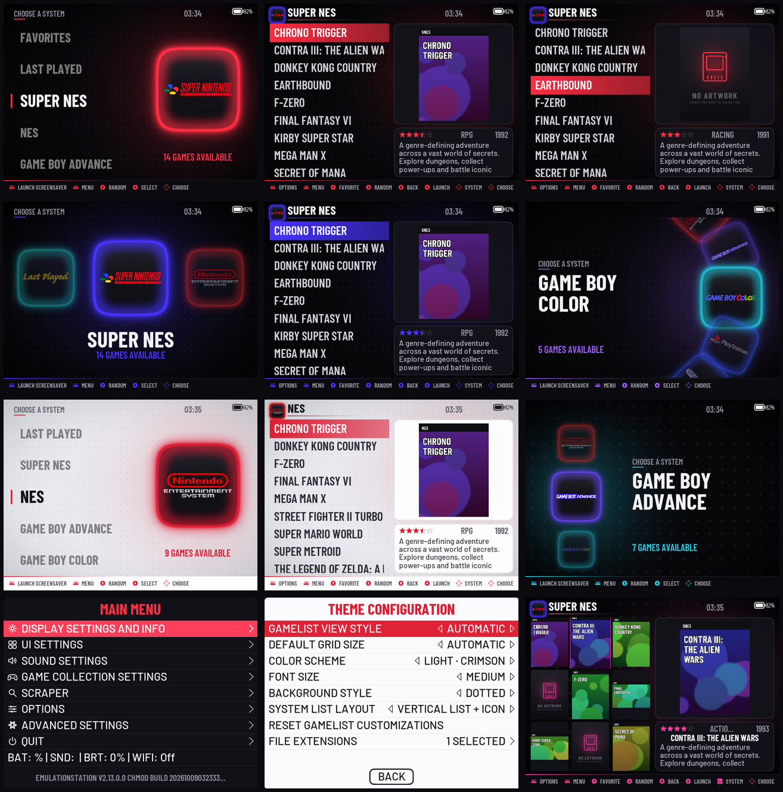

## Features

| | |
|---|---|
| **194 systems** | Each system gets a glowing glass tile built from high-quality vector logos. Every system in dArkOS/ArkOS `es_systems.cfg` is covered, plus ArkOS aliases, the auto collections and the arcade-manufacturer collections. |
| **13 color schemes** | Dark: Neon Red, Electric Blue, Amber Gold, Toxic Green, Ultra Violet, Hot Pink, Ice Cyan, Multicolor. Light: Crimson, Cobalt, Grape, Teal, Multicolor. In the *Multicolor* schemes the accent follows each system's own glow color. |
| **3 font sizes** | Small / Medium / Large, applied to every view and to the settings menus. |
| **4 system list layouts** | Vertical list + icon (the reference look), horizontal carousel, vertical carousel, wheel. |
| **3 backgrounds** | Dotted, Plus grid, Solid. |
| **Gamelist** | Game list on the left half. On the right, box art fills the top two thirds and rating, year, genre and description fill the bottom third. Detailed, video, grid and basic views are all themed. |
| **Missing box art** | A "No artwork" placeholder card in the accent color of each scheme. |
| **Settings menu** | Menus match the active scheme: fonts, colors, selector, switches, sliders, buttons and line icons. |
| **Battery** | The battery indicator (with % text) sits in the **top-right corner**. The theme keeps that corner clear in every view and draws it with its own icons, including a charging icon. |
| **Font** | Barlow Condensed for titles and lists, Barlow for body text (both SIL OFL). |

## Install

### Option A: copy the folder (simplest)

Copy the `neonglow` folder to the **themes** folder on the SD card's **EASYROMS** partition (it appears on the device as `/roms/themes/neonglow`). Then on the device, open **Start → UI Settings → Theme** and choose **NEONGLOW**.

### Option B: installer script

Copy this whole folder to EASYROMS as `neonglow-install`, then run it over SSH:

```
sudo /roms/neonglow-install/install.sh                      # copy the theme (nothing else)
sudo /roms/neonglow-install/install.sh --restore-originals  # undo v1.0's boot/loading changes
sudo /roms/neonglow-install/install.sh --uninstall          # remove the theme (+ restore originals)
```

You can also copy `extras/ports/NeonGlow Installer.sh` to `/roms/ports/` and run it from the *Ports* menu. It only copies the theme.

## Recovering from v1.0

v1.0 replaced the boot logo, the ES loading screen and the launch screen, and saved each original as `*.neonglow-bak`. To put them back:

* **If you can reach a shell (SSH):** run `sudo ./install.sh --restore-originals`.
* **From a PC, with the SD card in a reader:**
  1. On the **BOOT** partition: if `logo.bmp.neonglow-bak` exists, delete `logo.bmp` and rename `logo.bmp.neonglow-bak` to `logo.bmp`. Do the same for `logo_kernel.bmp.neonglow-bak` if it is there.
  2. On **EASYROMS**: if `launchimages/loading.jpg.neonglow-bak` exists, delete `loading.jpg` and rename the backup.
  3. If EmulationStation still restarts, delete `themes/neonglow` on EASYROMS. ES then falls back to another theme.
  4. The v1.0 ES splash (`/home/ark/.emulationstation/resources/splash.svg`) lives on the Linux partition. `--restore-originals` removes it. It is not needed for booting.

## Theme options

**Start → UI Settings → Theme Configuration**

* **COLOR SCHEME**: 8 dark and 5 light schemes. Each system can also have its own scheme.
* **FONT SIZE**: Medium / Small / Large
* **BACKGROUND STYLE**: Dotted / Solid / Plus grid
* **SYSTEM LIST LAYOUT**: Vertical list + icon / Horizontal carousel / Vertical carousel / Wheel
* **GAMELIST VIEW STYLE** (an ES option): Automatic / Basic / Detailed / Video / Grid

## Screens

| System list (red) | Gamelist | Missing box art |
|---|---|---|
| 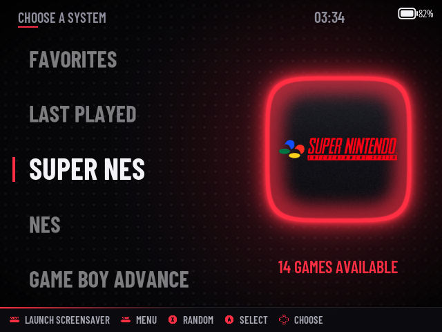 | 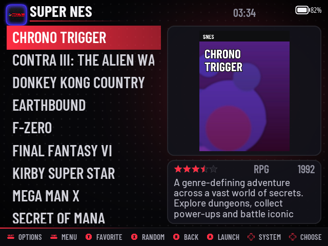 | 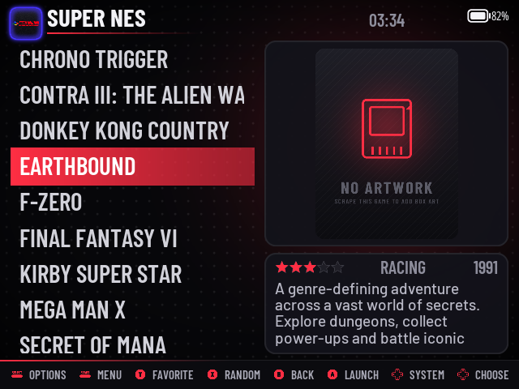 |
| **Horizontal (multicolor)** | **Vertical carousel** | **Wheel** |
| 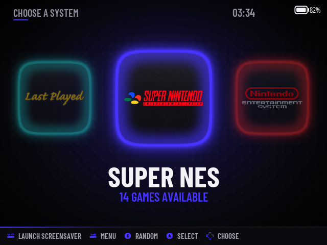 | 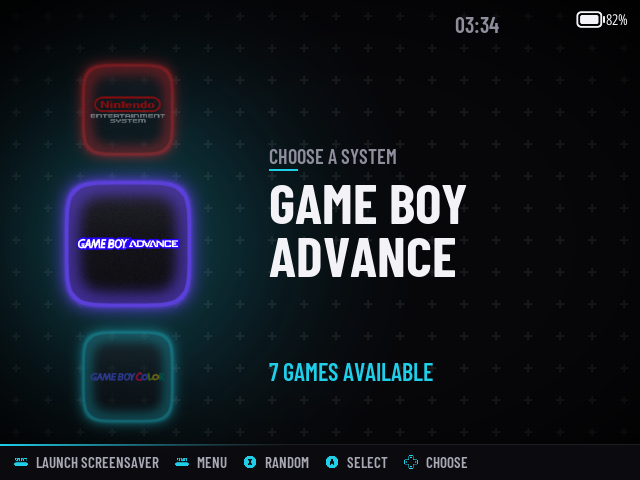 | 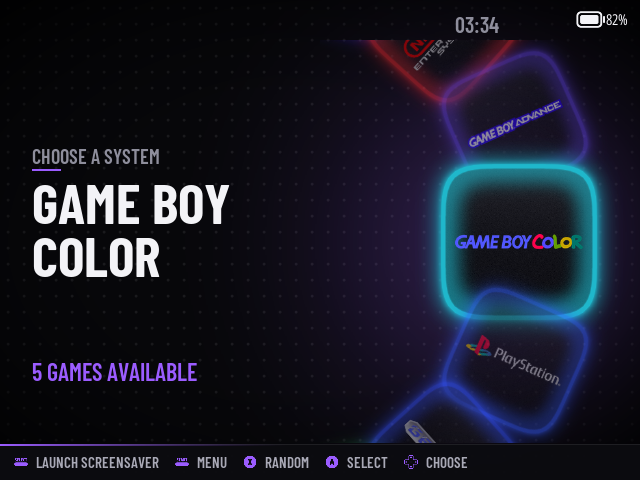 |
| **Light** | **Light gamelist** | **Light horizontal** |
| 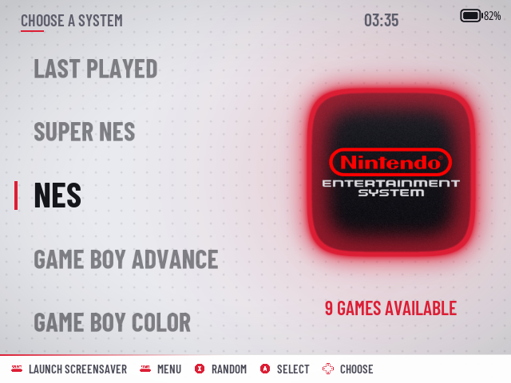 | 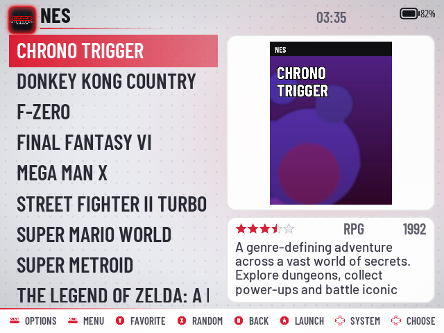 | 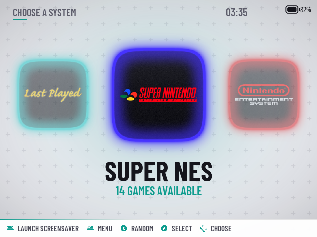 |
| **Settings menu** | **Theme configuration** | **Grid view** |
| 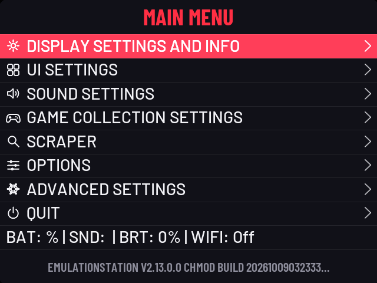 | 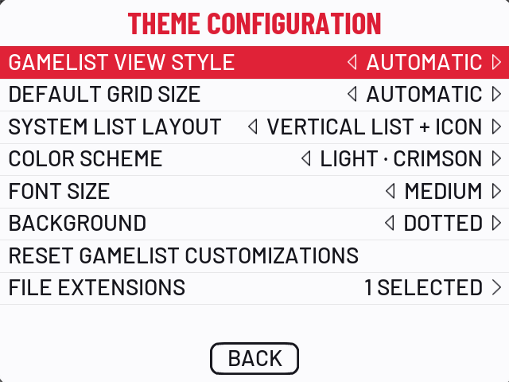 | 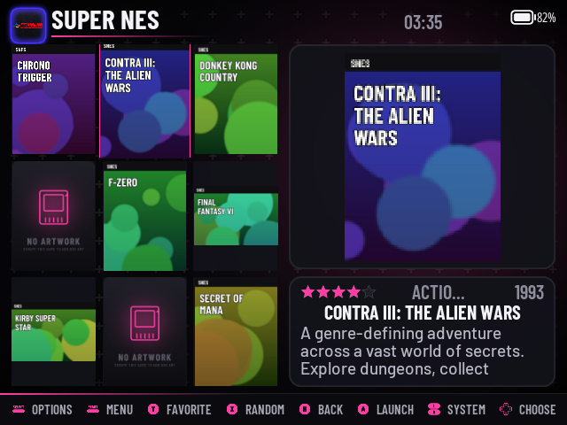 |

These screenshots come from the real ArkOS EmulationStation (`christianhaitian/EmulationStation-fcamod`, branch `351v`), built for desktop and run at 640×480. They are not mock-ups.

## How it was tested

* Built the R36S branch of ES-fcamod (`christianhaitian/EmulationStation-fcamod`, branch `351v`) for desktop and ran it under Xvfb at 640×480, with a fake battery, scraped and unscraped ROM folders, and the auto collections.
* Captured every layout, color scheme family, font size, view style (detailed, video, grid, basic) and menu. Every combination logs **zero theme warnings**.
* Ran an **AddressSanitizer + UBSan** build through system/gamelist navigation, the menus, and live theme switching (color scheme, font size, background, layout). The theme produced no memory errors or crashes.
* Loaded all 183 non-collection systems at once: zero warnings, and lower memory use than the Carbon theme (≈291 MB vs ≈347 MB peak RSS).
* Avoided the features that behave differently on the device's GLES 1.0 renderer: no `roundCorners` (which needs a stencil buffer ES doesn't request on GLES) and no tiled (`GL_REPEAT`) textures. Backgrounds are full-screen images.
* Ran the installer end to end on a simulated ArkOS layout (install, restore, uninstall) and checked it with `shellcheck`.

## Notes

* **Older ES builds.** On ES builds without `batteryIndicator` theming (non-351v branches), the battery element is ignored and ES's built-in indicator is used.
* **Boot/loading art.** The generator can still produce the boot logo / loading art (`python3 tools/build_assets.py --extras`), but none of it is shipped or installed.

## Rebuilding / customising

All art and XML is generated:

```
python3 tools/build_assets.py   # logos, glow tiles, backgrounds, UI icons, no-art cards
python3 tools/build_xml.py      # theme.xml, subsets, layouts, 194 system folders
```

* `tools/systems.py`: system → logo + glow color (add a line to support a new system)
* `tools/palette.py`: color schemes and accents
* `tools/build_xml.py`: layouts, font sizes and the gamelist geometry

Requirements: Python 3 with Pillow, numpy and fontTools; `rsvg-convert`; `git`. The logo pack is cloned automatically into `tools/.cache/`.

## Credits & licenses

* **System logos**: vector logos from the *Carbon* theme family (Rookervik / RetroPie, Batocera and fcamod contributors, [fabricecaruso/es-theme-carbon](https://github.com/fabricecaruso/es-theme-carbon)), licensed **CC BY-NC-SA**. This theme is therefore for **non-commercial use**. Console names and logos are trademarks of their respective owners.
* **Fonts**: Barlow / Barlow Condensed by Jeremy Tribby, SIL Open Font License (`tools/fonts/OFL.txt`).
* **Glow tiles, backgrounds, icons, placeholders and theme XML**: original work generated by the scripts in `tools/`.
